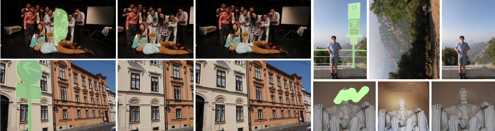

# TransFill-Reference-Inpainting
This is the official repo for TransFill: Reference-guided Image Inpainting by Merging Multiple Color and Spatial Transformations (Yuqian Zhou, Connelly Barnes, Eli Shechtman, Sohrab Amirghodsi) at CVPR'21. According to some confidential reasons, we are not planning to release the training/testing codes and models. Online-demo will be public once we set up the server. However, we release the testing dataset for comparsion, and the scripts to prepare the training dataset.

[[Paper]](https://openaccess.thecvf.com/content/CVPR2021/html/Zhou_TransFill_Reference-Guided_Image_Inpainting_by_Merging_Multiple_Color_and_Spatial_CVPR_2021_paper.html) | [[Project]](https://yzhouas.github.io/projects/TransFill/index.html) | [[Demo Video]](https://www.youtube.com/watch?v=TroIMZmQAZQ) 

## Introduction

<div align="center">
  
  Applications of TransFill: Photo Content Swap, Object Removal, Color Adjustment.
</div>

Image inpainting is the task of plausibly restoring missing pixels within a hole region that is to be removed from a target image. Most existing technologies exploit patch similarities within the image, or leverage large-scale training data to fill the hole using learned semantic and texture information. However, due to the ill-posed nature of the inpainting task, such methods struggle to complete larger holes containing complicated scenes. In this paper, we propose TransFill, a multi-homography transformed fusion method to fill the hole by referring to another source image that shares scene contents with the target image. We first align the source image to the target image by estimating multiple homographies guided by different depth levels. We then learn to adjust the color and apply a pixel-level warping to each homography-warped source image to make it more consistent with the target. Finally, a pixel-level fusion module is learned to selectively merge the different proposals. Our method achieves state-of-the-art performance on pairs of images across a variety of wide baselines and color differences, and generalizes to user-provided image pairs.

## Download and Prepare RealEstate10K
We prepare the script of downloading and extracting paired frames from RealEstate10K.
First, go to the RealEstate10K [official website](https://google.github.io/realestate10k/download.html) to download the .txt files.
Then unzip it and put the folder into the data folder.


Run our script to download the video samples and extract paired frames with frame difference (stride) 10, 20 and 30.
```
python download_realestate10k.py \
--txt_dir ./data/RealEstate10K/train \
--out_dir ./RealEstate10K_frames/train \
--dataset_dir ./RealEstate10K_pair/train \
--sample_num 10
```

Choose the sample number to download limited number of samples (say 100 videos). You may need to install [youtube-dl](https://pypi.org/project/youtube_dl/) package or VPNs (in Mainland China) to download YouTube videos. Google also has some limitations of downloading amount, so I did not use multi-thread to increase the downloading speed on purpose. The process is fairly long, so I suggest downloading a subset of videos to extract samples first, and gradually extending it to download the whole dataset. Any other downloading issues, please inquire the original provider of [RealEstate10K](https://google.github.io/realestate10k/download.html).


## Download Testing Data
We shared the testing images in the paper, including the 'Small Set' containing 300 pairs of images from RealEstate10K, and a 'Real Set' containing 100+ challenging paired images from users. The data can be downloaded from the [Google Drive](https://drive.google.com/file/d/15tjUa0WA5K6kyee3Juodzvr_zKzGJvUG/view?usp=sharing).

To reproduce the results in the Table 1 of the paper, download and unzip the 'Small Set' into data folder, and run
```
python compute_metrics.py
```
The script will compare the images generated by TransFill with the ground truth images in the target folder, and return PSNR, SSIM and LPIPS score.

In the 'Real Set', ProFill and TransFill results are shared for the researchers to compare. Note that there are some failure cases within the folder, which shows the room for future works to improve TransFill. 

## Test on Your Own Data
We plan to set up the online demo server in the near future. But before we finish that, if you are really eager for a comparsion of the results for research purpose, feel free to send the testing data in the format of 'target', 'source', 'hole' folders to zhouyuqian133@gmail.com (preferred) or yuqzhou@adobe.com. The resolution has better be smaller than 1K x 1K, otherwise we have to resize the image to avoid memory issues. To make fully use of the advantages of TransFill, we suggest the hole to be large enough by including more background contents of the target image. 

We won't keep your data and will return the testing results to you within 2 working days. 

## Citation
If you think this repo and the manuscript helpful, please consider citing us.
```
@inproceedings{zhou2021transfill,
  title={TransFill: Reference-guided Image Inpainting by Merging Multiple Color and Spatial Transformations},
  author={Zhou, Yuqian and Barnes, Connelly and Shechtman, Eli and Amirghodsi, Sohrab},
  booktitle={Proceedings of the IEEE/CVF Conference on Computer Vision and Pattern Recognition},
  pages={2266--2276},
  year={2021}
}
```

## Acknowledgements
This project is conducted when the author interned at Adobe Photoshop and Adobe Research.


